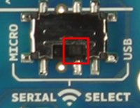
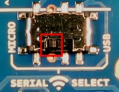

==================
configuration XBee
==================

Configuration des modules XBee pour une utilisation sur |OTBlogo| avec le protocole JPL.

.. |OTBlogo| image:: http://openthebox.org/wp-content/uploads/2014/06/OB-Logo.png

Références
----------
   * explications détaillés pour en savoir plus en français de la configuration : http://mchobby.be/wiki/index.php?title=Arduino_Wireless_Shield_XBee_802.15.4
   * 
   * 
   
Requirements
------------
   * |OTBlogo| http://openthebox.org
   * Arduino Uno
   * Arduino Wireless Proto Shield
   * XBee S1 de digi http://www.digi.com/products/wireless-wired-embedded-solutions/zigbee-rf-modules/xctu
   
   * XCTU Logiciel pour configurer les modules xbee (facultatif, pour vérifier la configuration)

   
Configurer le module Xbee
-------------------------

Dans un réseau XBee pour OpenTheBox, il y a un maître coté OpenTheBox (Raspberry pi) et n esclaves qui portent les prototypes d'objets communicants.
Pour fonctionner les modules doivent être sur le même **canal** et sur le même **PANID**. Par défaut, on ne touche rien d'autre sur la configuration.
La configuration.

Configurer module maître
------------------------

Pour le maître, il faut un sketch vide sur le microcontrolleur: 

.. code-block:: c

   /** Sketch pour le maître
    * A flasher en enlevant le module XBee.
    **/
   void setup() {
   }
   
   void loop() {
   }
   
Remettre le module XBee, puis mettre le bouton en position USB |WirelessShield_SD_switchUSB_detail|, brancher sur OpenTheBox.

Configurer module esclave
-------------------------

Pour l'esclace, utiliser la bibliothèque JPL.

.. code-block:: c

   /** Sketch pour le maître
    * A flasher en enlevant le module XBee.
    **/
   void setup() {
   }
   
   void loop() {
   }
   
Remettre le module XBee, puis mettre le bouton en position USB |WirelessShield_SD_switchMicro_detail|, brancher sur OpenTheBox.

