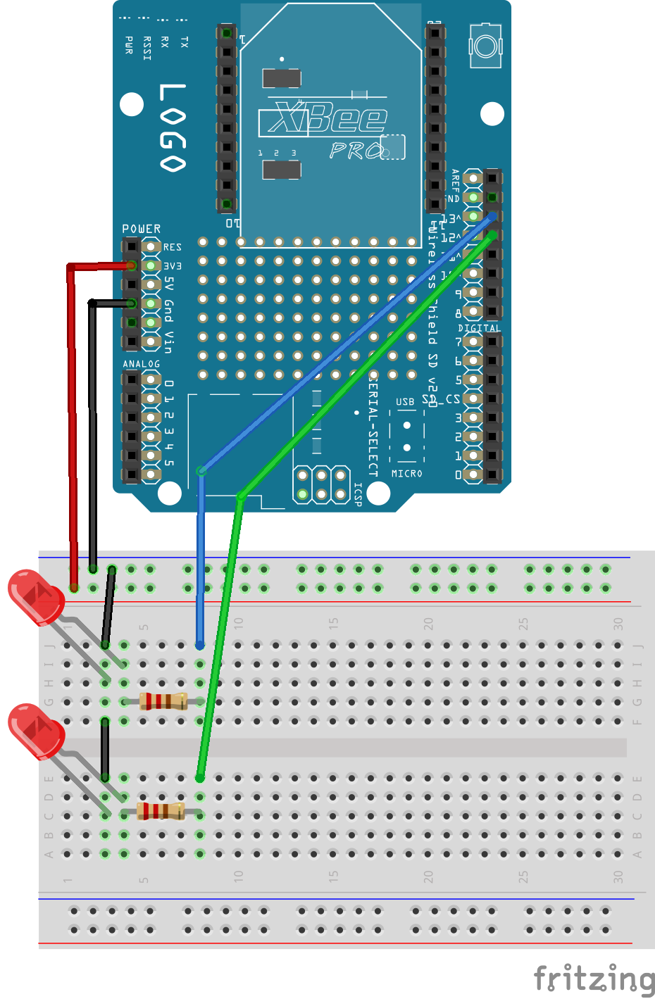
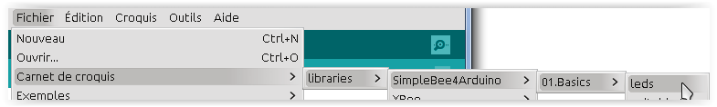

=============
Tutoriel Leds
=============

Ce tutoriel a pour objectif de proposer un montage Arduino comportant 2 leds, qui seront visibles sur une plateforme OpenTheBox.

.. _`Open The Box`: http://www.openthebox.org
.. |OTBlogo| image:: http://openthebox.org/wp-content/uploads/2014/06/OB-Logo.png
.. _`SimpleBee4Arduino Release`: https://github.com/Orange-OpenSource/SimpleBee4Arduino/releases/latest
.. _`SimpleBeeMessenger Release`: https://github.com/Orange-OpenSource/SimpleBeeMessenger/releases/latest

.. _`SimpleBee4Arduino`: https://github.com/Orange-OpenSource/SimpleBee4Arduino
.. _`SimpleBeeMessenger`: https://github.com/Orange-OpenSource/SimpleBeeMessenger

   
Requirements
------------
* |OTBlogo| http://openthebox.org
* Arduino IDE > 1.6
* Arduino Uno
* Arduino Wireless Proto Shield
* XBee S1 de digi http://www.digi.com/products/wireless-wired-embedded-solutions/zigbee-rf-modules/xctu
* Bibliothèques `SimpleBeeMessenger`_ et `SimpleBee4Arduino`_

Montage éléctronique
--------------------

   les Pin 13 et 12 sont branchées chacune sur une led.
   
Code Arduino
------------

la totalité du code pour ce tutoriel se trouve ici:

Attention lors du téléversement:
 * Si on est en mode simulation, cf ci dessous, bien prendre garde de téléverser vers la **bonne carte arduino**. A choisir dans le menu **outils > port**.
 * Qd on téléverse, **il faut retirer le module XBee de son support**, à défaut on risque de reprogrammer les autres arduino sur le même canal et le même PANID.

Définition des leds (fichier ledPinout.h)
~~~~~~~~~~~~~~~~~~~~~~~~~~~~~~~~~~~~~~~~~
Ici il s'agit de réaliser le comportement que l'on souhaite de notre dispositif électronique en accords avec les actions de la plateforme OpenTheBox.

Quand un message arrive de OpenTheBox, la méthode **newMessage** est appelée avec le message entrant, c'est ici qu'il faut faire son action (allumé, éteindre...).

.. code-block:: c

   /**
    * Override Led to process events
    */
   class MyLed : public SBLed { // A lots of things is already do by SBLed class : ie message analysis
   public:
     int pin;
     /**
      * Contructors
      */
     MyLed(const int pin, unsigned long hearbeat_period_ms=500) : SBLed(hearbeat_period_ms) , pin(pin) {
         pinMode(pin, OUTPUT);
     };
     /**
      * Init comm and hardware when address is requested
      */
     virtual void start(void) {
       SBLed::start();
       digitalWrite(pin,HIGH);
     };
      
     /**
      * Init comm and hardware when address is knwown by device
      */
     virtual void setAddr(const char * newAddress) {
       SBLed::setAddr(newAddress);
       digitalWrite(pin,HIGH);
     };
     
   
     /**
      * on change from OTB
      */
     virtual void newMessage(char *message) {
       SBLed::newMessage(message); // Message analysis that set le value member
       digitalWrite(pin,value);
     };
   };

 
 
Croquis principal (fichier leds.ino)
~~~~~~~~~~~~~~~~~~~~~~~~~~~~~~~~~~~~

C'est le programme principal, qui consiste essentiellement à configurer l'ensemble: montage et ses branchemements, l'émission, réception et distribution des messages arrivant de OpenTheBox.

.. code-block:: c

   /* LED example
    *
    * Version:     0.1.0
    * Created:     2015-02-25 by Franck Roudet
    */
   #include <SBMessenger.h>
   #include <sbmessage.h>
   #include <sbdevice.h>
   #include <sbdispatcherdevice.h>
   
   #include "LedPinout.h"
   
   
   /**
     * Dispatcher for incoming Simple Bee message 
     */
   SBDispatcherDevice disp;
   
   
   /**
    * Simple bee message manager
    */
   SBMessenger sbmessenger(Serial,SBEndOfMessage, &disp, SBCheckSum);
   
   
   
   
   /**
    * Declare my devices
    */
   const char * const ledType="001";
   MyLed led1(13);               // led1 on pin13 - default heart type
   MyLed led2(12, 3000);         // led2 on pin12 - 3sec
   
   /**
    * List of monitoring devices
    */
   SBDevice * stbDeviceList[]={ &led1, &led2, NULL }; // WARNING: must ends with NULL
   
   
   
   void setup() {
     // Start the serial port
     Serial.begin(57600);
   
     
     // Set list of device for dispatching
     disp.setDeviceList(stbDeviceList);
   
   
     //Serial.print("-starting\r");
   
     delay(500); // Waiting radio
     
     // Start device if necessary ia ask for address
     // start all (WARNING OTB don't do that !!!!!! so set addr
     //for (SBDevice **device=stbDeviceList;*device;device++) {
     //  (*device)->start();
     //}
     
     // set address
     led1.setAddr("0101");
     led2.setAddr("0102");
     
     led1.value=1;
     led1.batteryLevel=5;
     led2.value=2;
     led2.batteryLevel=9;
   
   }
   
   
   void loop() {
     // Looks for incoming message
     sbmessenger.monitor();
   
   } 
 
 
Connexion avec OpenTheBox
-------------------------

Voir le tutoriel sur  `Open The Box`_

Pour tester sans OpenTheBox
---------------------------

Vous devez avoir **Python 2.X** installé, et **pip**.

Puis installer fysom:

.. code-block:: bash

   pip install fyson

Brancher le dongle/montage arduino maître sur le PC.

Utiliser le simulateur python **simplebee.py** OpenTheBox qui de trouve https://github.com/Orange-OpenSource/SimpleBee4Arduino/tree/master/tools

Avant d'utiliser le simulateur, il faut identifier le port sur lequel est branché le dongle/montage arduino maître (celà dépends de  l'OS).

Lancer le simulateur, par exemple sur linux:

.. code-block:: bash

   $python simplebee.py --debug --baudrate 57600 --port /dev/ttyACM0
   2015-03-18 11:11:56,563 - DEBUG simplebee - debug is on
   2015-03-18 11:11:56,564 - DEBUG simplebee - Reading on /dev/ttyACM0
   2015-03-18 11:34:31,740 - ERROR simplebee -   ->Unknown device 0102 auto provide
   2015-03-18 11:34:31,740 - DEBUG simplebee - Build that A {'typemodule': u'A001', 'addr': '0102', 'ser': Serial<id=0x7fd07322ea50, open=True>(port='/dev/ttyACM0', baudrate=57600, bytesize=8, parity='N', stopbits=1, timeout=None, xonxoff=False, rtscts=False, dsrdtr=False)}
   2015-03-18 11:34:31,740 - DEBUG simplebee - PseudoDevice {'typemodule': u'A001', 'addr': '0102', 'ser': Serial<id=0x7fd07322ea50, open=True>(port='/dev/ttyACM0', baudrate=57600, bytesize=8, parity='N', stopbits=1, timeout=None, xonxoff=False, rtscts=False, dsrdtr=False)}
   2015-03-18 11:34:31,741 - DEBUG simplebee - Module of type A001 at address 0102 detected
   2015-03-18 11:34:31,741 - INFO simplebee -      [Identified 0102]
   2015-03-18 11:34:31,741 - INFO simplebee -      [new value from 0102]
   2015-03-18 11:34:31,741 - INFO simplebee -       {'batteryLevel': u'9', 'value': u'0'}
   2015-03-18 11:34:31,741 - INFO simplebee - -> send actuator ack event r01021
   2015-03-18 11:34:31,742 - INFO simplebee -      [Identified 0102]
   2015-03-18 11:34:31,742 - DEBUG simplebee - Mesg type='R' len=14 'R01011B5A0018>'
   2015-03-18 11:34:31,742 - ERROR simplebee -   ->Unknown device 0101 auto provide
   2015-03-18 11:34:31,742 - DEBUG simplebee - Build that A {'typemodule': u'A001', 'addr': '0101', 'ser': Serial<id=0x7fd07322ea50, open=True>(port='/dev/ttyACM0', baudrate=57600, bytesize=8, parity='N', stopbits=1, timeout=None, xonxoff=False, rtscts=False, dsrdtr=False)}
   2015-03-18 11:34:31,742 - DEBUG simplebee - PseudoDevice {'typemodule': u'A001', 'addr': '0101', 'ser': Serial<id=0x7fd07322ea50, open=True>(port='/dev/ttyACM0', baudrate=57600, bytesize=8, parity='N', stopbits=1, timeout=None, xonxoff=False, rtscts=False, dsrdtr=False)}
   2015-03-18 11:34:31,743 - DEBUG simplebee - Module of type A001 at address 0101 detected
   2015-03-18 11:34:31,743 - INFO simplebee -      [Identified 0101]
   2015-03-18 11:34:31,743 - INFO simplebee -      [new value from 0101]
   2015-03-18 11:34:31,743 - INFO simplebee -       {'batteryLevel': u'5', 'value': u'1'}
   2015-03-18 11:34:31,743 - INFO simplebee - -> send actuator ack event r01012
   
Le simulateur permet:
 * de voir les messages des devices sur le canal/PANID configuré
 * de répondre au messages des devices
 * Les leds clignotent au rythme du hearbeat (par défaut 500 ms)
 * d'émettre les acquittements des messages des buttons et interupteurs

 