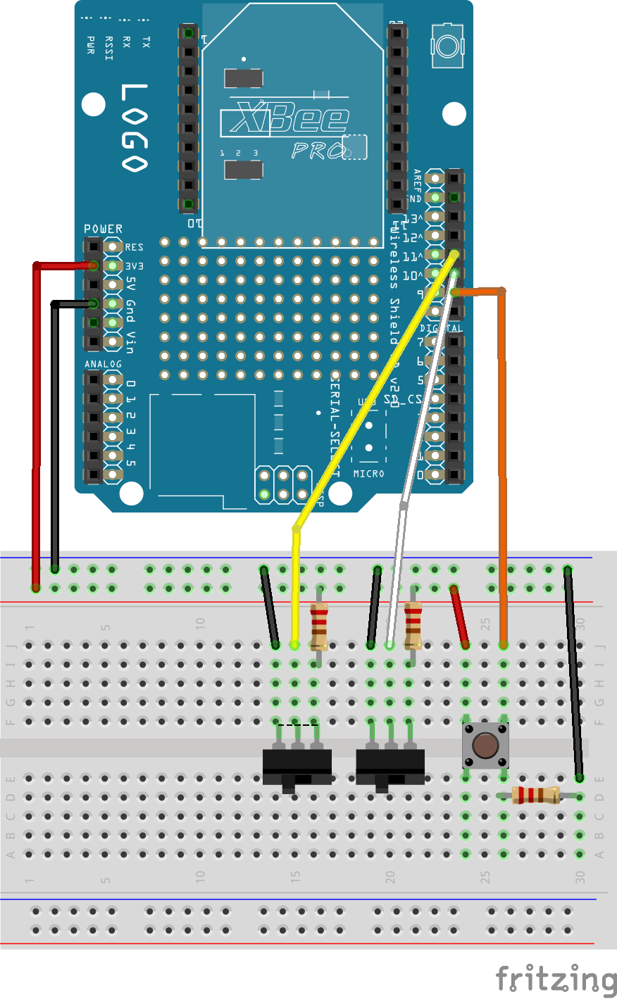
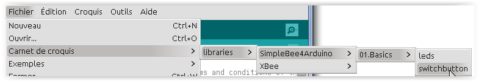

========================================
Tutoriel bouton poussoir et interrupteur
========================================

Ce tutoriel a pour objectif de proposer un montage Arduino comportant un bouton poussoir et deux interrupteurs, qui seront visibles sur une plateforme OpenTheBox.

.. _`Open The Box`: http://www.openthebox.org
.. |OTBlogo| image:: http://openthebox.org/wp-content/uploads/2014/06/OB-Logo.png
.. _`SimpleBee4Arduino Release`: https://github.com/Orange-OpenSource/SimpleBee4Arduino/releases/latest
.. _`SimpleBeeMessenger Release`: https://github.com/Orange-OpenSource/SimpleBeeMessenger/releases/latest

.. _`SimpleBee4Arduino`: https://github.com/Orange-OpenSource/SimpleBee4Arduino
.. _`SimpleBeeMessenger`: https://github.com/Orange-OpenSource/SimpleBeeMessenger

   
Requirements
------------
* |OTBlogo| http://openthebox.org
* Arduino IDE > 1.6
* Arduino Uno
* Arduino Wireless Proto Shield
* XBee S1 de digi
* Bibliothèques `SimpleBeeMessenger`_ et `SimpleBee4Arduino`_

Montage électronique
--------------------

le Pin 9 est attribué au bouton poussoir et les pin 10 et 11 à un interrupteur chacun.

Code Arduino
------------

la totalité du code pour ce tutoriel se trouve ici:

Attention lors du téléversement:
 * Si on est en mode simulation, cf ci dessous, bien prendre garde de téléverser vers la **bonne carte arduino**. A choisir dans le menu **outils > port**.
 * Quand on téléverse, **il faut retirer le module XBee de son support**, à défaut on risque de reprogrammer les autres arduino sur le même canal et le même PANID.

Définition de l'interface de changement des états de boutons (fichier checkChangeMixin.h)
~~~~~~~~~~~~~~~~~~~~~~~~~~~~~~~~~~~~~~~~~~~~~~~~~~~~~~~~~~~~~~~~~~~~~~~~~~~~~~~~~~~~~~~~~

Définition d'une interface C++ à implémenter pour les boutons poussoirs et les interupteurs.

.. code-block:: c

   /*
    * Copyright (C) 2015 Orange
    *
    * This software is distributed under the terms and conditions of the 'Apache-2.0'
    * license which can be found in the file 'LICENSE.txt' in this package distribution
    * or at 'http://www.apache.org/licenses/LICENSE-2.0'.
    */
   
   #ifndef __checkChangeMixin_H_
   #define __checkChangeMixin_H_
   
   class CheckChangeMixin {
      public:
      
     /**
      * check hardware changes
      */  
     virtual void checkChange(void)=0;
     
    };
   #endif

Définition des boutons poussoir (fichier PushPinout.h)
~~~~~~~~~~~~~~~~~~~~~~~~~~~~~~~~~~~~~~~~~~~~~~~~~~~~~~

Ici il s'agit de réaliser le comportement que l'on souhaite des boutons poussoirs en accord avec les actions de la plateforme OpenTheBox.

Un message heartbeat (Message watchdog dans la spécification) doit être envoyé régulièrement vers OpenTheBox, la méthode **sendHeartBeat** doit être renseignée.

Si un changement d'état survient, on peut emettre immédiatement ce nouvel état, la méthode **checkChange** doit être renseignée et émettre le message.

.. code-block:: c

   /**
    * Override Push Button to process events
    */
   
   #include "checkChangeMixin.h"
   
   class MyPush : public SBPush, public CheckChangeMixin {
   public:
     int pin;
     /**
      * Contructors
      */
     MyPush(const int pin, unsigned long hearbeat_period_ms=60000) : SBPush(hearbeat_period_ms) , pin(pin) {
       pinMode(pin, INPUT);
       value=digitalRead(pin);  
     };
     
     /**
      * Heart beat
      */  
     virtual void sendHeartBeat(void) {
       value=digitalRead(pin);
       SBPush::sendHeartBeat();
     };
   
   
     /**
      * check hardware changes
      */  
     virtual void checkChange(void) {
       char actualValue = digitalRead(pin);
       if (actualValue!=value) {
          value=actualValue;
          sendMessageData();
       }
     }
   };

Définition des interrupteurs (fichier SwitchPinout.h)
~~~~~~~~~~~~~~~~~~~~~~~~~~~~~~~~~~~~~~~~~~~~~~~~~~~~~

Ici il s'agit de réaliser le comportement que l'on souhaite des interrupteurs en accord avec les actions de la plateforme OpenTheBox.

Un message heartbeat (Message watchdog dans la spécification) doit être envoyé régulièrement vers OpenTheBox, la méthode **sendHeartBeat** doit être renseignée.

Si un changement d'état survient, on peut emettre immédiatement ce nouvel état, la méthode **checkChange** doit être renseignée et émettre le message.

.. code-block:: c

   #include "checkChangeMixin.h"
   /**
    * Override Switch to process events
    */
   class MySwitch : public SBSwitch, public CheckChangeMixin {
   public:
     int pin;
     /**
      * Contructors
      */
     MySwitch(const int pin, unsigned long hearbeat_period_ms=60000) : SBSwitch(hearbeat_period_ms) , pin(pin) {
       pinMode(pin, INPUT);
       value=digitalRead(pin);  
     };
     
   
     /**
      * Heart beat
      */  
     virtual void sendHeartBeat(void) {
       value=digitalRead(pin);
       SBSwitch::sendHeartBeat();
     };
   
   
     /**
      * check hardware changes
      */  
     virtual void checkChange(void) {
       char actualValue = digitalRead(pin);
       if (actualValue!=value) {
          value=actualValue;
          sendMessageData();
       }
     }
   };

Croquis principal (fichier switchbutton.ino)
~~~~~~~~~~~~~~~~~~~~~~~~~~~~~~~~~~~~~~~~~~~~

C'est le programme principal, qui consiste essentiellement à configurer l'ensemble: montage et ses branchemements, l'émission, réception et distribution des messages arrivant de OpenTheBox.

.. code-block:: c

   /* Switch button example
    *
    * Version:     0.1.0
    * Created:     2015-03-02 by Franck Roudet
    */
   #include <SBMessenger.h>
   #include <sbmessage.h>
   #include <sbdevice.h>
   #include <sbdispatcherdevice.h>
   
   #include "SwitchPinout.h"
   #include "PushPinout.h"
   
   
   /**
     * Dispatcher for incoming Simple Bee message 
     */
   SBDispatcherDevice disp;
   
   
   /**
    * Simple bee message manager
    */
   SBMessenger sbmessenger(Serial,SBEndOfMessage, &disp, SBCheckSum);
   
   
   
   /**
    * Declare my devices
    */
   MySwitch  switch1(11);          // switch1 on pin11 - default heart type
   MySwitch  switch2(10, 120000);  // switch2 on pin10 - 2 min en milli secondes
   MyPush    push1(9);             // push1 on pin9 - default heart type
   
   /**
    * List of monitoring devices
    */
   SBDevice * stbDeviceList[]={ &switch1, &switch2, &push1, NULL }; // WARNING: must ends with NULL
   
   
   /**
    * Sensor list for checking Hardware;
    */ 
   CheckChangeMixin * stbDeviceHardwareList[]={ &switch1, &switch2, &push1, NULL }; // WARNING: must ends with NULL
   
   void setup() {
     // Start the serial port
     Serial.begin(57600);
     
     // Set list of device for dispatching
     disp.setDeviceList(stbDeviceList);
      
     delay(500); // Waiting radio
     
     // Start device if necessary ia ask for address
     // start all (WARNING OTB don't do that !!!!!! so set addr
     //for (SBDevice **device=stbDeviceList;*device;device++) {
     //  (*device)->start();
     //}
   
     // set addresses
     switch1.setAddr("2001");
     switch2.setAddr("2002");
     push1.setAddr("1001");
   }
   
   
   void loop() {
     // Looks for incoming message
     sbmessenger.monitor();
   
     // Check for Hardware changes
     for (CheckChangeMixin **device=stbDeviceHardwareList;*device;device++) {
       (*device)->checkChange();
     }
   }

Pour tester sans OpenTheBox
---------------------------

Vous devez avoir **Python 2.X** installé, et **pip**.

Puis installer fysom et pyserial:

.. code-block:: bash

   pip install fysom
   pip install pyserial

Brancher le dongle/montage arduino maître sur le PC.

Utiliser le simulateur python **simplebee.py** OpenTheBox qui de trouve https://github.com/Orange-OpenSource/SimpleBee4Arduino/tree/master/tools/

Avant d'utiliser le simulateur, il faut identifier le port sur lequel est branché le dongle/montage arduino maître (celà dépends de l'OS - COMX ou /dev/ttyACMX).
Lancer le simulateur, par exemple sur linux:

.. code-block:: bash

   $python simplebee.py --debug --baudrate 57600 --port COM6
   2015-03-18 17:32:35,069 - DEBUG simplebee - debug is on
   2015-03-18 17:32:35,069 - DEBUG simplebee - Reading on COM6
   
   2015-03-18 17:33:39,786 - DEBUG simplebee - Mesg type='W' len=14 'W20010B9C0029:'
   2015-03-18 17:33:39,787 - ERROR simplebee -   ->Unknown device 2001 auto provide
   2015-03-18 17:33:39,787 - DEBUG simplebee - Build that C {'typemodule': u'C002', 'addr': '2001', 'ser': Serial<id=0x7fca64238a50, open=True>(port='/dev/ttyACM1', baudrate=57600, bytesize=8, parity='N', stopbits=1, timeout=None, xonxoff=False, rtscts=False, dsrdtr=False)}
   2015-03-18 17:33:39,787 - DEBUG simplebee - PseudoDevice {'typemodule': u'C002', 'addr': '2001', 'ser': Serial<id=0x7fca64238a50, open=True>(port='/dev/ttyACM1', baudrate=57600, bytesize=8, parity='N', stopbits=1, timeout=None, xonxoff=False, rtscts=False, dsrdtr=False)}
   2015-03-18 17:33:39,788 - DEBUG simplebee - Module of type C002 at address 2001 detected
   2015-03-18 17:33:39,788 - INFO simplebee -      [Identified 2001]
   2015-03-18 17:33:39,788 - INFO simplebee -      [new value from 2001]
   2015-03-18 17:33:39,789 - INFO simplebee -       {'batteryLevel': u'9', 'value': u'0'}
   2015-03-18 17:33:39,789 - INFO simplebee - -> send sensor ack event w20010
   2015-03-18 17:33:39,790 - INFO simplebee -      [Identified 2001]
   2015-03-18 17:33:39,791 - DEBUG simplebee - Mesg type='W' len=14 'W10010B9C00198'
   2015-03-18 17:33:39,791 - ERROR simplebee -   ->Unknown device 1001 auto provide
   2015-03-18 17:33:39,791 - DEBUG simplebee - Build that C {'typemodule': u'C001', 'addr': '1001', 'ser': Serial<id=0x7fca64238a50, open=True>(port='/dev/ttyACM1', baudrate=57600, bytesize=8, parity='N', stopbits=1, timeout=None, xonxoff=False, rtscts=False, dsrdtr=False)}
   2015-03-18 17:33:39,791 - DEBUG simplebee - PseudoDevice {'typemodule': u'C001', 'addr': '1001', 'ser': Serial<id=0x7fca64238a50, open=True>(port='/dev/ttyACM1', baudrate=57600, bytesize=8, parity='N', stopbits=1, timeout=None, xonxoff=False, rtscts=False, dsrdtr=False)}
   2015-03-18 17:33:39,792 - DEBUG simplebee - Module of type C001 at address 1001 detected
   2015-03-18 17:33:39,792 - INFO simplebee -      [Identified 1001]
   2015-03-18 17:33:39,792 - INFO simplebee -      [new value from 1001]
   2015-03-18 17:33:39,792 - INFO simplebee -       {'batteryLevel': u'9', 'value': u'0'}
   2015-03-18 17:33:39,792 - INFO simplebee - -> send sensor ack event w10010
   2015-03-18 17:33:39,794 - INFO simplebee -      [Identified 1001]
   2015-03-18 17:34:39,836 - DEBUG simplebee - Mesg type='W' len=14 'W20020B9C0029;'
   2015-03-18 17:34:39,837 - ERROR simplebee -   ->Unknown device 2002 auto provide
   2015-03-18 17:34:39,837 - DEBUG simplebee - Build that C {'typemodule': u'C002', 'addr': '2002', 'ser': Serial<id=0x7fca64238a50, open=True>(port='/dev/ttyACM1', baudrate=57600, bytesize=8, parity='N', stopbits=1, timeout=None, xonxoff=False, rtscts=False, dsrdtr=False)}
   2015-03-18 17:34:39,837 - DEBUG simplebee - PseudoDevice {'typemodule': u'C002', 'addr': '2002', 'ser': Serial<id=0x7fca64238a50, open=True>(port='/dev/ttyACM1', baudrate=57600, bytesize=8, parity='N', stopbits=1, timeout=None, xonxoff=False, rtscts=False, dsrdtr=False)}
   2015-03-18 17:34:39,838 - DEBUG simplebee - Module of type C002 at address 2002 detected
   2015-03-18 17:34:39,838 - INFO simplebee -      [Identified 2002]
   2015-03-18 17:34:39,838 - INFO simplebee -      [new value from 2002]
   2015-03-18 17:34:39,838 - INFO simplebee -       {'batteryLevel': u'9', 'value': u'0'}
   2015-03-18 17:34:39,838 - INFO simplebee - -> send sensor ack event w20020
   2015-03-18 17:34:39,840 - INFO simplebee -      [Identified 2002]
   
Le simulateur permet:
* de voir les messages des devices sur le canal/PANID configuré
* de répondre au messages des devices:
 * Les leds clignotes au rythme du hearbeat (par défaut 500 ms)
 * acquittement de message des buttons et interupteur
   
